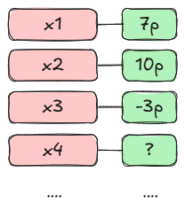

# Un etiquetador de cosas

Que las máquinas aprendan por su cuenta parece cosa de magia:magic_wand:.

Además, los términos asociados se encuentran de moda:

Pero antes de dejarnos hechizar empecemos por el principio, por la esencia misma del concepto, donde la realidad resulta ser más tangible. 

Porque Machine Learning es básicamente:

!!! note "Un etiquetador :material-tag:"

    Machine Learning viene a ser un programa que etiqueta cosas.

Por ejemplo, etiqueta si un email es spam o no:

O asigna un precio a cierta cosa definida por sus características:

O bien asigna una puntuación a cada posible posición a la que se puede mover el joystick en el juego de Atari:

O asigna una palabra a una cadena de palabras precedentes en un modelo de lenguaje:

Una vez asignadas las etiquetas, el programa se encuentra en posición de tomar una decisión. Si las etiquetas las asignó correctamente, la decisión que toma en base a ellas a menudo da la impresión de ser (y de hecho es) inteligente.

!!! note "La inteligencia"

    Viene del hecho de tomar decisiones basándose en el etiquetado previo.

Ahora bien, si queremos que un ordenador decida por nosotros, tendremos que hacer que la información de entrada (los datos) los convierta en etiquetas a través de algún tipo de "receta".

Y es en la técnica de confeccionar esta receta donde se encuentra la clave que define al Machine Learning.