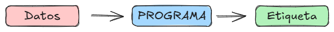

# Un cambio de paradigma

¿Cómo componemos la receta o programa?

Tradicionalmente, un programador (humano) codificaría las instrucciones necesarias. Es decir, tecleando proporcionaría al ordenador las reglas de etiquetado de la información, mediante fórmulas matemáticas, condiciones lógicas o lo que sea.

El ordenador procesaría los datos de entrada junto con el programa para proporcionar los resultados.

En Machine Learning sin embargo ya no elaboramos la receta manualmente. La tarea del programador ya no es codificar, sino proporcionar datos de ejemplo a la máquina, la cual, con un algoritmo, confeccionará la receta.

Constituye un cambio de paradigma por cuanto es el propio sistema quien aprende las reglas a partir del aprendizaje o entrenamiento con esos datos de ejemplo.

Al programa obtenido como resultado de este aprendizaje se le llama _modelo_, pues representa una realidad que de alguna manera se halla recogida en esos datos.

