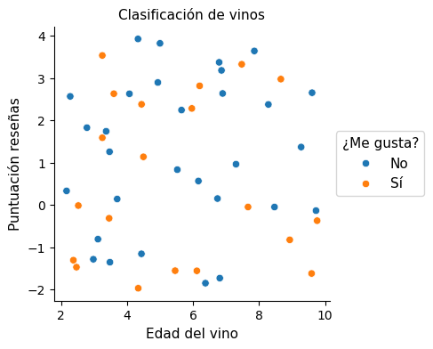
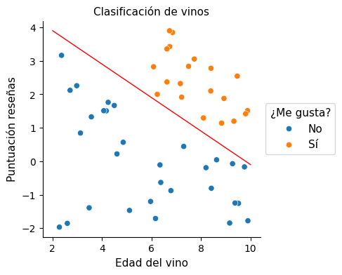
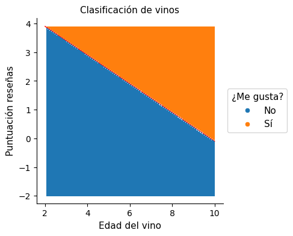
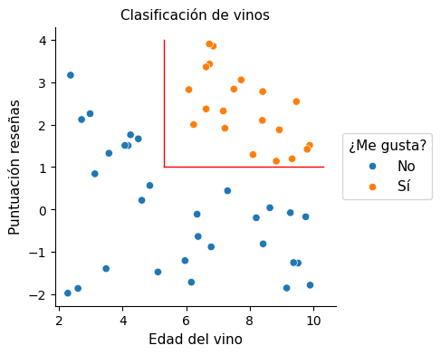
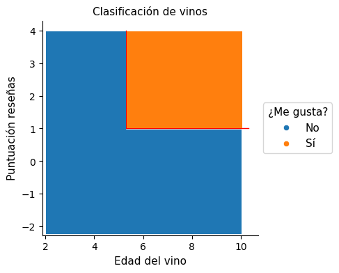

# :material-glass-wine: Modelo de clasificación

Supongamos que durante un tiempo he estado probando diferentes vinos y apuntando si me gustaban o no. Para cada uno de esos vinos anoto también su edad y busco en una revista especializada la puntuación que obtiene por parte de un experto, todo lo cual plasmo en la siguiente gráfica:

A partir de aquí, la tarea consiste en adivinar si me va a gustar o no una nueva botella de vino. Es decir, partiendo de su edad y puntuación, el objetivo es ponerle una de estas dos etiquetas:

:material-tag: "Me gusta"  
:material-tag: "No me gusta"    

¿Advertimos algún patrón en los datos mostrados en la gráfica? ¿Algún criterio que nos permita separar los vinos que me gustan de los que no? ¿Una receta que nos facilite hacer las predicciones?

No, lo cierto es que no hay ninguna pauta, porque los datos de la gráfica han sido colocados de manera aleatoria.

Y si resulta que nos parecía haber entrevisto algo, si hemos empezado a jugar con algún tipo de razonamiento que explique la distribución y en el que podríamos basarnos para redactar una receta, esa es nuestra imaginativa mente que se pone a elucubrar, fantaseando con cosas que no existen. El engaño nos podría hacer pensar que hemos dado con una estrategia que podemos explotar, pero claro, las cosas saldrán mal cuando la utilicemos con datos nuevos.

!!! warning "El Machine Learning puede hacer exactamente lo mismo que nosotros"

    Encontrar patrones que no existen. Y por tanto esto nos conducirá a soluciones que no funcionan.

La estrategia a emplear para protegernos de este problema será la misma que deberíamos adoptar para protegernos de nuestras intuiciones humanas: tomar toda aproximación con cautela y comprobar si lo supuesto funciona con datos nuevos.

En la siguiente gráfica sí que hay un patrón claro:

Por lo visto solo me gustan los vinos añejos que hayan obtenido una alta puntuación.

¿Cómo podríamos _definir_ este patrón? Podríamos trazar por ejemplo una línea recta que hiciera de muro de separación entre las dos regiones:

De esta manera conseguimos una receta (un modelo) para que cualquier nuevo dato (botella :fontawesome-solid-wine-bottle:) que caiga en una u otra región quede automáticamente etiquetada como "Me gusta" o "No me gusta":

Aunque esa frontera no necesariamente tiene que ser una línea recta. Diferentes algoritmos del Machine Learning se diferencian en parte por la forma empleada en estas separaciones, que pueden ser líneas rectas, cuadrículas o líneas curvas:

|separador|algoritmo|
|--|--|
|\\ | SVC (Support Vector Classifier)|
|\|_| Decision Trees (árboles de decisión)|
|~ | Neural Networks (redes neuronales)|

Una vez seleccionado el algoritmo, el mismo se encargará de ajustar dicha frontera por medio de su forma característica. Por ejemplo, si se emplea un algoritmo de árboles de decisión la partición podría tomar el siguiente aspecto:

Y la receta o modelo, quedaría así:

Tenemos por tanto dos modelos, pero ¿cuál de ellos deberíamos utilizar?