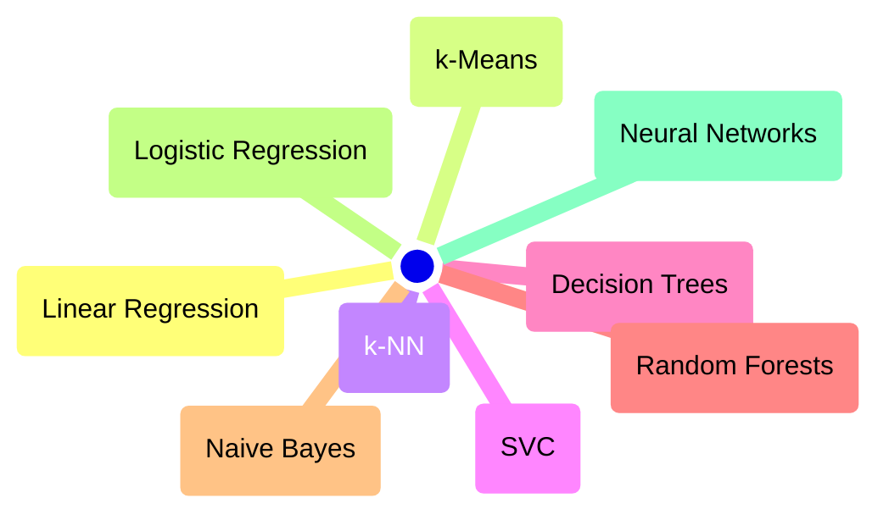

# Algoritmos

¿Qué es, por lo tanto, Machine Learning? He aquí una definición:

!!! note "Machine Learning"

    Método de __etiquetado__ y __toma de decisiones__ que implica buscar por medio de __algoritmos__ patrones en los datos con los que confeccionar __modelos__ que __generalicen__ con datos completamente nuevos.

Dentro de esa caja negra que parece el Machine Learning hay por tanto algoritmos.

He aquí algunos de los algoritmos más habituales:

El algoritmo no es más que un conjunto repetitivo de operaciones matemáticas que siguiendo un criterio busca maximizar o minimizar un resultado.

En Machine Learning normalmente se busca minimizar un error y el criterio es lo que define el tipo algoritmo.

Se verá más claro en el siguiente ejemplo.