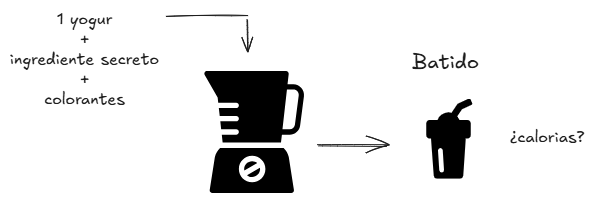
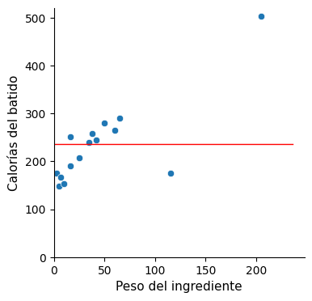

# :material-blender: Regresión lineal

Vayamos con otro ejemplo que servirá para introducir la idea que hay detrás del algortimo de Regresión Lineal.


Supongamos que vamos a hacer batidos. Los batidos se componen de un yogur, un ingrediente secreto y colorantes. Se bate todo junto en una batidora y se sirve (en nuestro caso se muestra la imagen del batido).

Ahora, la propuesta consiste en adivinar la cantidad de calorías que contiene.



¿100 calorías? ¿300 calorías? ¿500?

Aunque parezca una broma (pues evidentemente no sabemos lo suficiente, solo disponemos de una imagen), la idea de lanzar así la cuestión es la de comprobar nuestra disposición. Porque la actitud hacia el Machine Learning no es la del perfeccionismo, la de pensar con cuidado y dar con la respuesta correcta a la primera, sin intentarlo a no ser que estemos seguros de acertar. No, la postura a adoptar es la del ensayo y sondeo. Equivócate porque vas a fallar y lo vas a tener que intentar una y otra vez hasta que finalmente funcione. Y tienes que probar algo para saber qué hacer a continuación.

!!! note "Los algoritmos de Machine Learning hacen exactamente lo mismo"

    Echan a andar de forma arbitraria, hasta que el criterio que los define les va indicando el camino a seguir.

El ingrediente secreto del batido resulta ser 58g de sardinas (¡?), y las calorías totales del batido nos dicen que son 265.

Se prepara otro batido (esperemos que más apetecible). En este el ingrediente secreto es 50g de gofres y la cantidad de calorías 281.

De esta manera se van preparando hasta un total de 15 batidos diferentes, cuyas calorías se listan a continuación:

```
265, 281, 207, 148, 240, 154, 176, 290, 167, 245, 176, 259, 251, 503, 191
```

Lo cierto es que una ristra de números, así puestos, no nos dicen demasiado. De manera que los resumimos calculando la media:

```
Media --> 236,9 calorías
```

Se presenta ahora un nuevo batido, el cual está compuesto por 88g de quiche (¡?) y la pregunta de siempre: ¿cuántas calorías tiene?

Ahora, intuitivamente aproximaremos nuestra respuesta a la media. Con esta nueva referencia que nos han proporcionado, el abanico de cifras que antes lanzábamos al tuntún se reducirá considerablemente al entorno del promedio.

Pues bien, aunque hayamos apostado por cifras en torno a las 237 calorías, resulta que el batido mostrado de quiche tiene 445 calorías, de manera que nos hemos desviado bastante en nuestra aproximación, en concreto el error ha sido de 445 – 237 = 208 calorías.

Por tanto, nos hace falta más información. ¿Ayudaría disponer del peso en gramos del ingrediente del que se compone el batido?

Representémoslo en una gráfica:


La idea parece prometedora ya que el peso del ingrediente muestra cierta correspondencia con las calorías (a más peso, el batido tiende a tener más calorías).

Trazar una línea recta nos ayudará. Se compone de dos parámetros, la pendiente y la ordenada en el origen:

```
CALORÍAS = ordenada + (pendiente * PESO)
```

¿Qué valores les damos? O lo que es lo mismo: ¿dónde colocamos la recta?

{ width="250" }
{ width="250" } 
{ width="250" } 

Ninguna de estas rectas parece satisfactoria, y menos aún la última, la de pendiente nula. Y sin embargo, la línea horizontal es precisamente el modelo que teníamos poco antes, cuando sin información del peso todo lo que teníamos era la media.

```
CALORÍAS = 236,9 + (0 * PESO) => 236,9
```

De esto trata precisamente la búsqueda de atributos (_Feature engineering_), de incorporar al modelo variables que ayuden a aproximar la solución. Y cuando las añadimos, de pronto mejoramos el resultado. En la medida en que agregamos información relevante, la previsión mejora. Es lo que estamos haciendo desde que tenemos en cuenta el peso del ingrediente del batido.

!!! note "Feature Engineering"

    Incorporación de variables o atributos que ayuden a construir un modelo que mejore la predicción.

De manera que el objetivo ahora es encontrar una línea recta que se ajuste lo máximo posible a los datos, es decir, una recta que minimice el error de desviación del conjunto de los puntos. Podríamos hacerlo intuitivamente, pero hay que ser preciso, por lo que necesitamos definir matemáticamente un parámetro que mida el "error de desviación del conjunto de los puntos con respecto a la recta".

Se utiliza el llamado RMSE (Root Mean Squared Error), un indicador que se calcula de la siguiente manera:

1. Para cada dato, a su valor se le resta el que aporta la recta en ese punto.
2. Se calcula el cuadrado de dicha diferencia.
3. Se suman así todos esos valores cuadrados.
4. Y finalmente se calcula la raíz cuadrada de dicha suma.

Cada recta propuesta dará como resultado un valor concreto de RMSE. En el caso del modelo de la línea horizontal, en el que solo contemplábamos el valor medio (sin el peso del ingrediente), si hacemos los cálculos obtenemos:

```
CALORÍAS = 236,9 + (0 * PESO)   ---> RMSE = 84,6
```

Sabemos que este resultado es mejorable (pues hay rectas que se ajustan más al conjunto de datos). ¿Cómo podemos dar con aquella que minimice el valor de RMSE?


- ^^A mano^^: podríamos jugar con los parámetros de pendiente y ordenada hasta encontrarla.
- ^^Analíticamente^^: podríamos llenar una pizarra empleando fórmulas en esos cálculos matemáticos para encontrar el resultado (un método de la vieja escuela, ¿quién hace este tipo de cálculos hoy en día?)
- ^^Computacionalmente^^: podemos utilizar un algoritmo de optimización que haga el trabajo por nosotros y nos dé una respuesta valiéndonos de la potencia de cálculo de un ordenador. Esto es precisamente lo que hace un algoritmo de Machine Learning.

!!! note "Algoritmo de Machine Learning"

    Soluciona de manera computacional el problema de encontrar el modelo, que es el que satisface un criterio de optimización de un parámetro de error.

En el ejemplo de los batidos, ejecutando el algoritmo logramos la siguiente recta:


Que con sus parámetros de ordenada (175) y pendiente (1,35) minimiza el valor de RMSE:

```
CALORÍAS = 175 + (1,35 * PESO)   ---> RMSE = 48,8
```

Pues bien, recordando que el batido número 16 de Cassie (el de quiche) tenía 445 calorías, ahora nos dice que su ingrediente tiene un peso de 88 gramos. Veamos por cuánto se desvía de nuestro modelo.

```
CALORÍAS = 175 + (1,35 * 88) = 293,8 → 445 – 293,8 ≈ 151
```

Se desvía por un valor de 151 calorías:


Vemos que efectivamente el resultado obtenido mejora el anterior:

|Modelo|	RMSE|	Desviación|
|-|-|-|
|`Valor medio`|	84,6|	208|
|`Regresión lineal simple`|	48,8|	151|