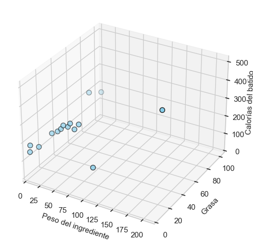

# :material-blender: Regresión lineal múltiple

¿Podemos mejorarlo aún más? Para ello haría falta más información, necesitamos más datos.

Pero más datos no en el sentido de más cantidad de ellos, sino en el sentido de otros tipos de información, es decir, más atributos, más variables que ayuden a pronosticar mejor.

¿Podría ayudar si incluimos en el modelo el porcentaje de grasa del ingrediente?

```
CALORÍAS = ordenada + (pendiente1 * PESO) + (pendiente2 * GRASA%)
```

La gráfica de puntos resulta tridimensional:



Ahora, en lugar de una línea, lo que hay que aproximar a los puntos en el espacio es un plano que se acerque lo máximo a ellos, minimizando el RMSE igual que antes. Ejecutando el algoritmo que minimiza el error de desviación, obtenemos el siguiente resultado:

```
CALORÍAS = 163 + (1,42 * PESO) + (51,9 * GRASA%)   ---> RMSE = 46,9
```


De manera que al incluir el porcentaje de grasa, doblando el número de variables en nuestro modelo, todo lo que obtenemos es esa mínima mejora, pasando de RMSE = 48,8 a RMSE = 46,9.

|Modelo|	RMSE|	Desviación|
|-|-|-|
|`Valor medio`|	84,6|	208|
|`Regresión lineal simple`|	48,8|	151|
|`Regresión lineal múltiple`|	46,9|	143|

Quizá, después de todo, el porcentaje de grasa no sea una información que contenga gran poder predictivo. Visto esto, quizá nos interese más utilizar el modelo anterior, que era más simple. Aunque siempre podemos probar ambos en un nuevo conjunto de datos para comprobar cuál de los dos funciona mejor.

¿Se pueden mejorar estos resultados?

Un experto en nutrición nos proporcionaría una buena pista para lograrlo. Nos indicaría que las calorías en el batido dependen esencialmente del peso de las grasas, de los carbohidratos y de las proteínas. Así que la mejor manera de construir nuestro modelo sería apoyándonos en estos tres atributos:

```
CALORÍAS = ord + (pend1 * GRASA) + (pend2 * CARBOHIDRATOS) + (pend3 * PROTEÍNAS)
```

Esta fórmula del modelo ya no representaría un plano, sino un hiperplano. Dibujémoslo:


No, mejor no (no se puede en el espacio tridimensional).

En cualquier caso no hay necesidad de dibujarlo, el cálculo que hace el algoritmo para minimizar la desviación funciona de la misma manera independientemente de las dimensiones del modelo.

!!! note "Multidimensionalidad"

    En Machine Learning los conceptos se explican a menudo en dimensiones reducidas para facilitar su explicación, pero en la realidad esos mismos conceptos funcionan en un conjunto mayor de dimensiones.

Estos son los resultados de ordenada y pendientes obtenidos para el hiperplano:

```
Calorías = 143 + (8,9 * GRASA) + (3,9 * CARBOHIDRATOS) + (4,3 * PROTEÍNAS)
```

Lo que el mismo indica es que los carbohidratos aportan aproximadamente 4 calorías por gramo, las proteínas andan también en ese rango, y la grasa aporta 9 calorías por gramo. El valor de ordenada en el origen revela las calorías que aporta el yogur (143: son las calorías de un batido cuyo ingrediente único sea agua).

Veámos los resultados en la tabla resumen:

|Modelo|	RMSE|	Desviación|
|-|-|-|
|`Valor medio`|	84,6|	208|
|`Regresión lineal simple`|	48,8|	151|
|`Regresión lineal múltiple`|	46,9|	143|
|`Hiperplano`|	3,8|	4|

¡Este último es un resultado muy bueno!

Estamos cometiendo un error promedio de unas 3,8 calorías y la desviación respecto al batido de quiche es de tan solo 4 calorías.

Contar con la ayuda de un nutricionista resultó crucial para incorporar en los datos el peso de las grasas, de los carbohidratos y de las proteínas.

!!! note "El conocimiento en la materia"

    Es fundamental para definir los atributos o variables que contengan información predictiva de calidad con la que construir el modelo.

A dicho proceso de definición de atributos o variables se le conoce con el nombre de Feature Engineering.

Por regla general, en los resultados obtenidos en el Machine Learning suelen ser más decisivos aspectos como la calidad de los datos y los atributos que representan, antes que el tipo de algoritmo que se emplee en la consecución del modelo.