<!-- Global style -->
<style>
section {
  background: #FFFFFF;
}
</style>

<!-- Scoped style -->
<style scoped>
section {
  display: flex; flex-direction: column; justify-content: center; height: 100vh;
}
h1 {
  text-align: center;
}
h2 {
  text-align: center;
}
</style>

# MACHINE LEARNING
## La base de la Inteligencia Artificial

---

## Las reglas del juego

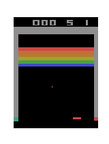


---

## Terminología

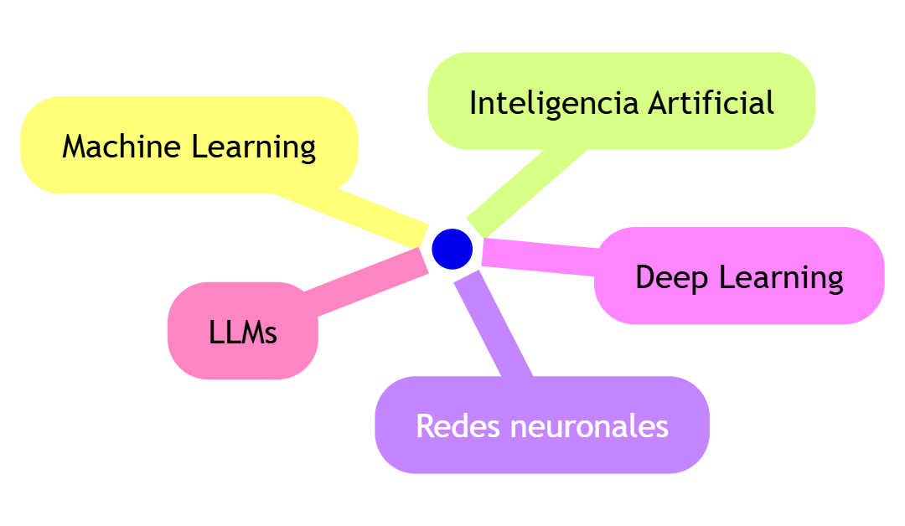

---

## Etiquetador de cosas

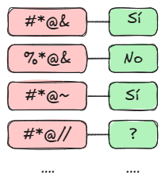
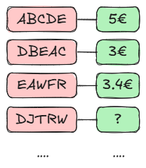
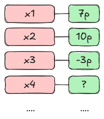
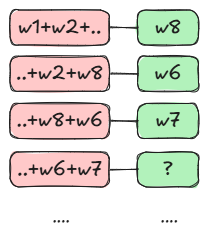

---

## Receta (programa)


---

## Programación tradicional

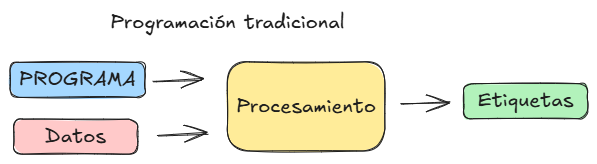

---

## Cambio de paradigma

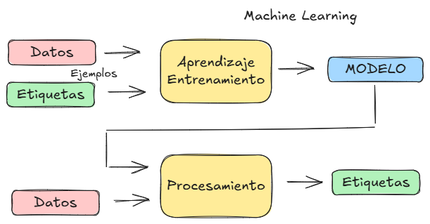

---

## Generalizar con datos nuevos

```
día     dosis
1   ->  28 mg
2   ->  17 mg
3   ->  92 mg
4   ->  41 mg
5   ->   9 mg
..
60  ->  86 mg
```

---

## Clasificación

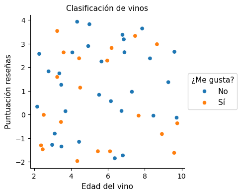

---

## Patrón

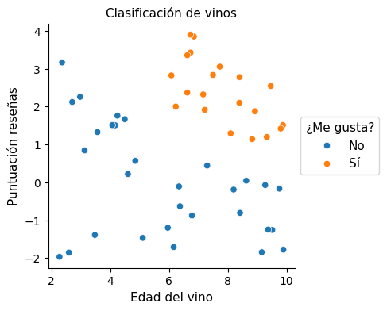

---

## Modelo SVC

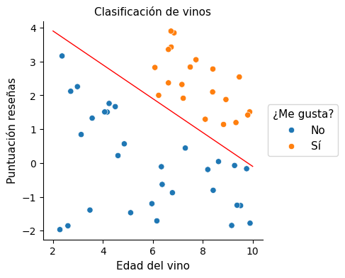
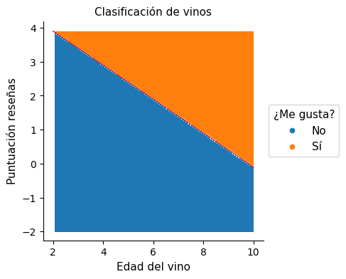

---

## Modelo Árbol de decisión

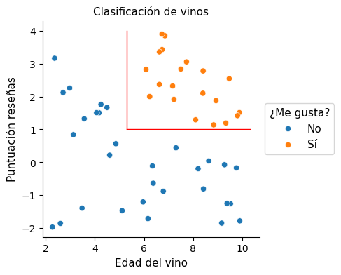
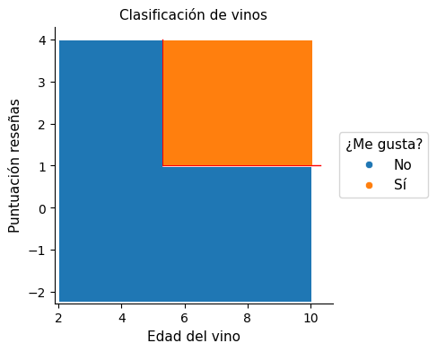

---

## Validación

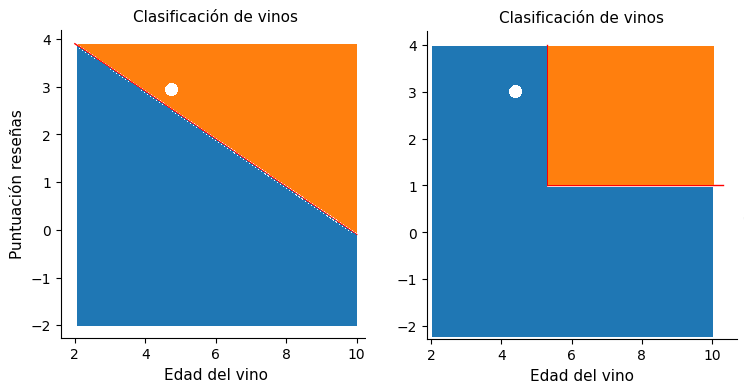

---

## Validación

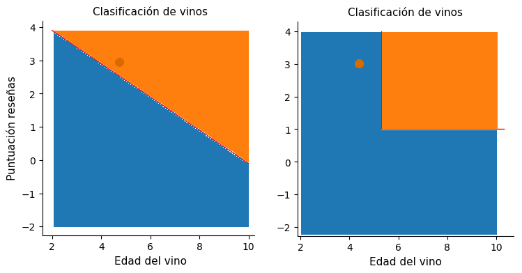

---

## Algoritmo

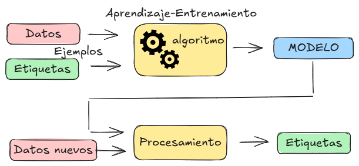

---

## Algoritmos

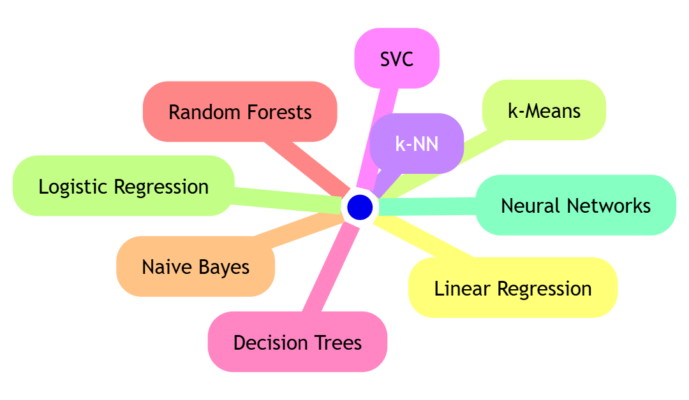

---

## Caso práctico

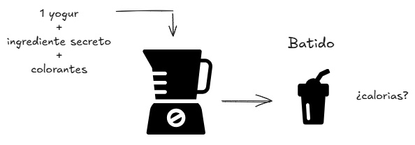

---

## Media

```
265, 281, 207, 148, 240, 154, 176, 290, 167, 245, 176, 259, 251, 503, 191
```

```
Media --> 236,9 calorías
```
---

## Puntos

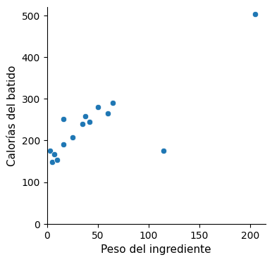

---

## Aproximaciones

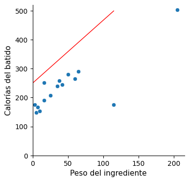
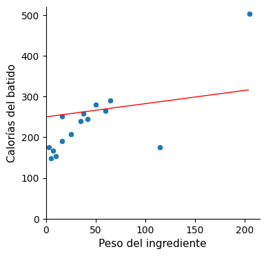
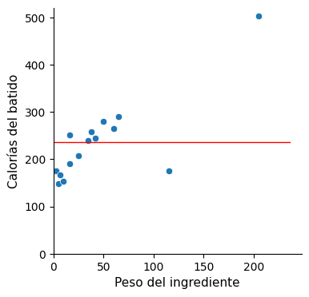

---

## Regresión lineal simple

```
CALORÍAS = ordenada + (pendiente * PESO)
```
```
CALORÍAS = 236,9 + (0 * PESO) => 236,9
```
```
CALORÍAS = 236,9 + (0 * PESO)   ---> RMSE = 84,6
```

---

## Regresión lineal

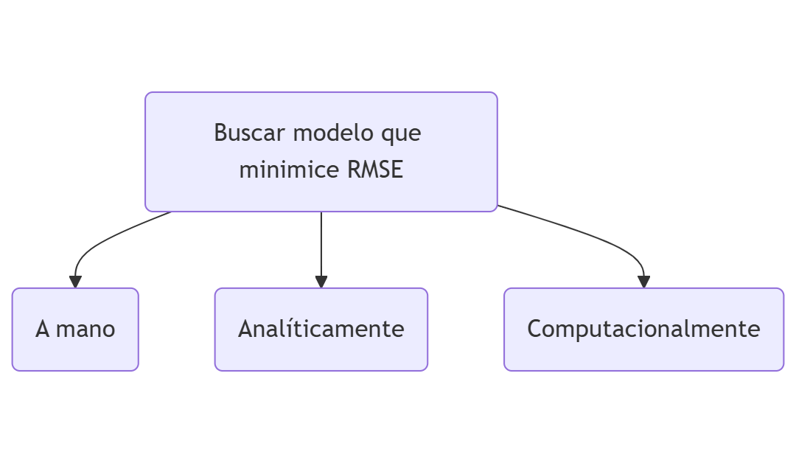

---

## Regresión lineal

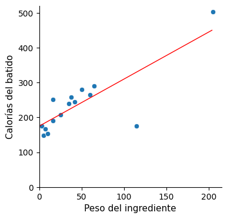

---

## Regresión lineal

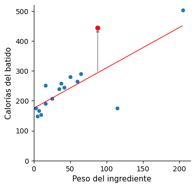

---

## Regresión lineal

```
CALORÍAS = 175 + (1,35 * PESO)   ---> RMSE = 48,8
```
```
CALORÍAS = 175 + (1,35 * 88) = 293,8 → 445 – 293,8 ≈ 151
```

|Modelo|	RMSE|	Desviación|
|-|-|-|
|`Valor medio`|	84,6|	208|
|`Regresión lineal simple`|	48,8|	151|

---

## RL múltiple

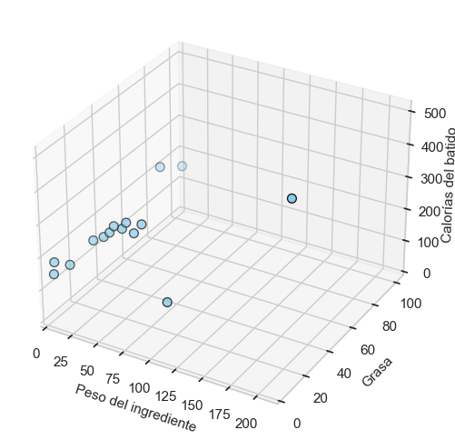

---

## RL múltiple: Plano

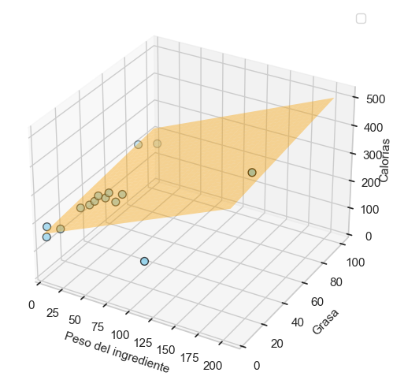

---

## Regresión lineal múltiple

```
CALORÍAS = ordenada + (pendiente1 * PESO) + (pendiente2 * GRASA%)
```
```
CALORÍAS = 163 + (1,42 * PESO) + (51,9 * GRASA%)   ---> RMSE = 46,9
```
|Modelo|	RMSE|	Desviación|
|-|-|-|
|`Valor medio`|	84,6|	208|
|`Regresión lineal simple`|	48,8|	151|
|`Regresión lineal múltiple`|	46,9|	143|

---

## RL múltiple: Hiperplano

```
CALORÍAS = ord + (pend1 * GRASA) + (pend2 * CARBOHIDRATOS) + (pend3 * PROTEÍNAS)
```
Dibújalo...


---

## RL múltiple: Hiperplano

```
Calorías = 143 + (8,9 * GRASA) + (3,9 * CARBOHIDRATOS) + (4,3 * PROTEÍNAS)
```

|Modelo|	RMSE|	Desviación|
|-|-|-|
|`Valor medio`|	84,6|	208|
|`Regresión lineal simple`|	48,8|	151|
|`Regresión lineal múltiple`|	46,9|	143|
|`Hiperplano`|	3,8|	4|

---

## ¿Qué es entonces la IA?

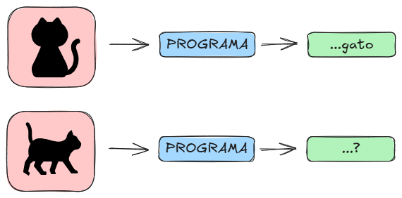

---

## ¿Qué es entonces la IA?

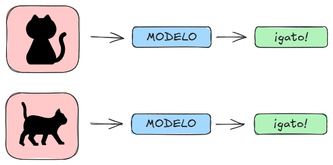

---

## IA

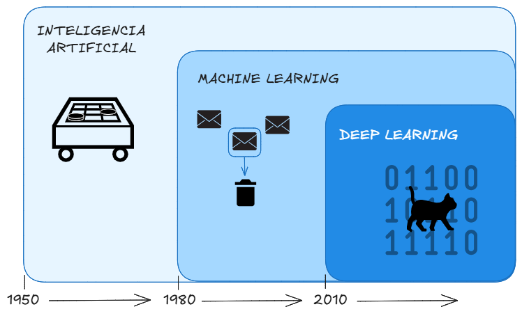

---

## ¿Y por qué ahora?

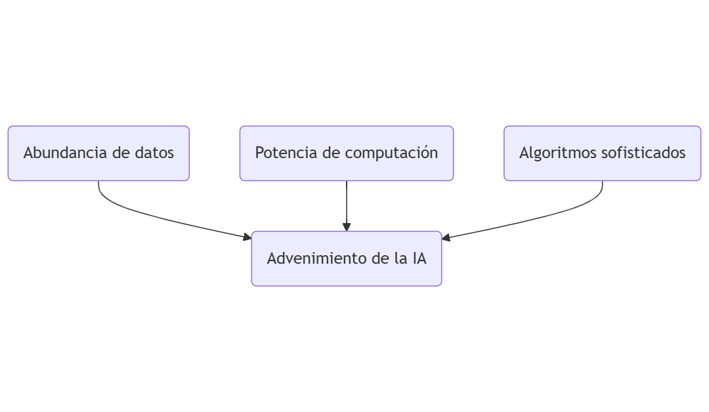